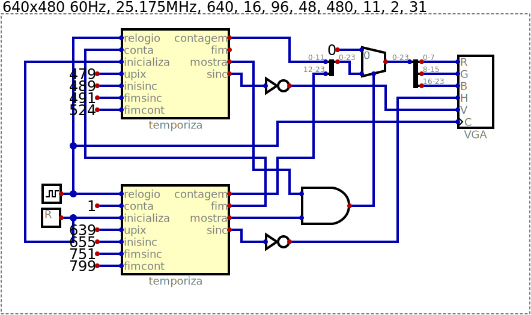

# Experimentos de Vídeo

Este circuito compara dois número de 12 bits fazendo um XOR
entre eles e confirmando que o resultado é zero via um NOR
de todos os bits.

## Primeira imagem - padrão de cores

## Padrão quadriculado

## Padrão de texto

## Retângulos

