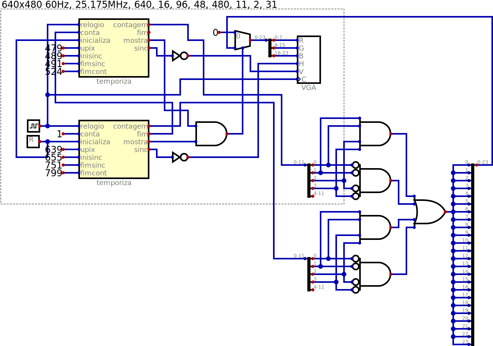
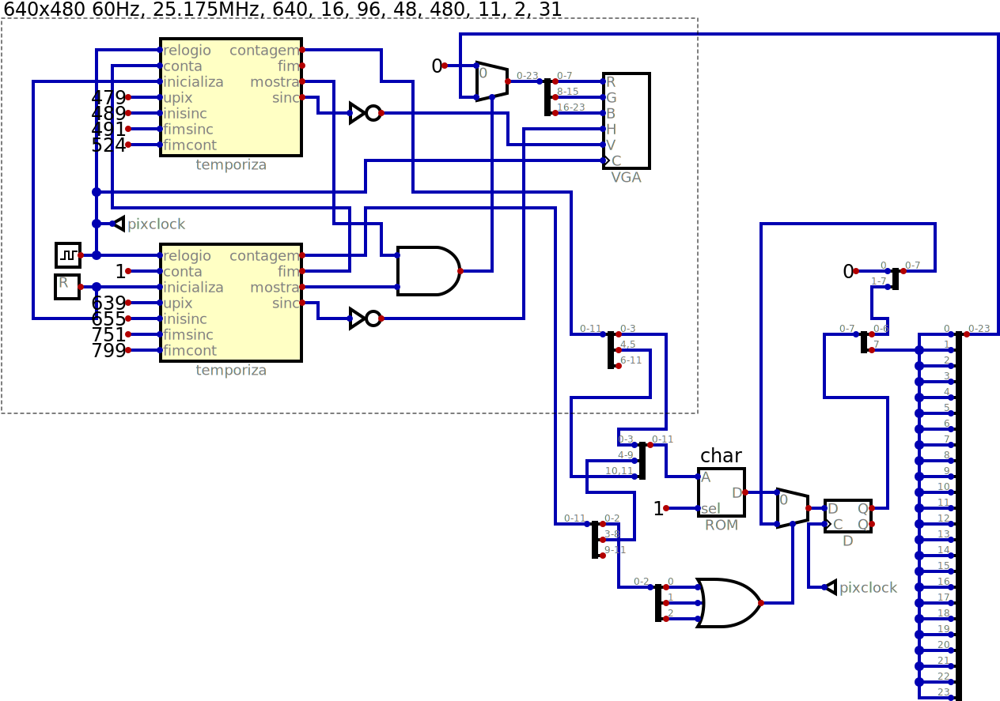
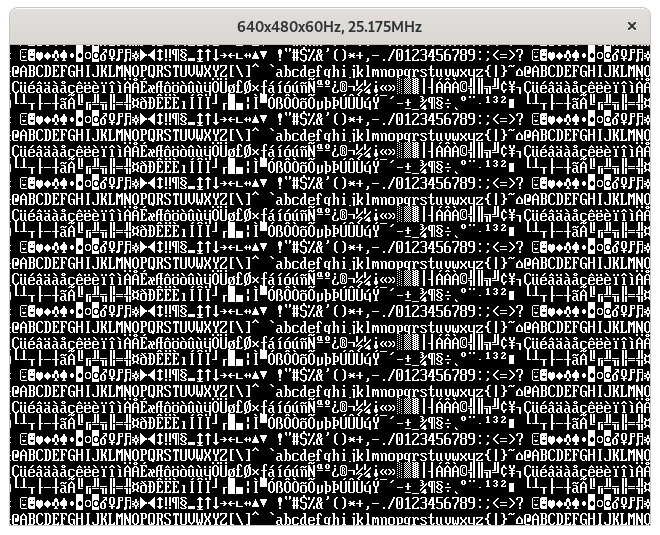

# Simple video output test circuits

The first test is the basic counter which
generates the synchronization pulse and the
display enable signal.

Then two synch circuits are connected together
and their counts are used to generate a color
pattern.

A pattern of vertical and horizontal lines is
used to test alignment.

A simple 8x16 character ROM has its output serialized.

First implementation of a palette circuit using two
rectangle generators.

